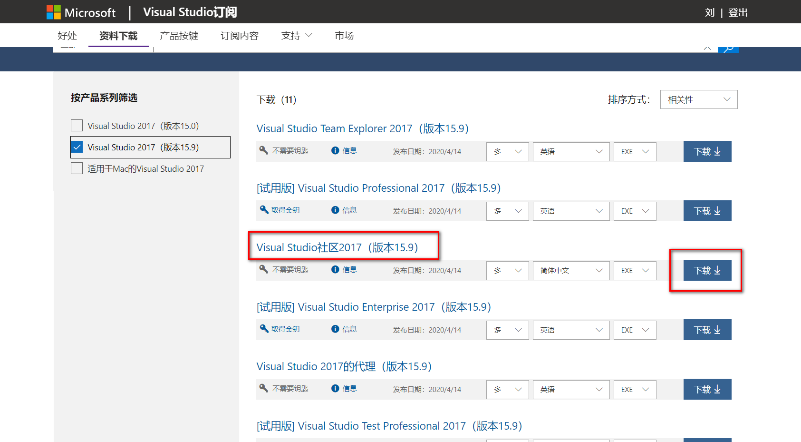

## SFML VS2017安装

[SFML官网](https://sfml-dev.org/index.php)的库最高支持到VS2017，所以特此下载了VS2017版。

## VS2017安装

现在安装VS2017连下载网址都要找半天：

https://docs.microsoft.com/en-us/visualstudio/releasenotes/vs2017-relnotes

需要账号登陆然后订阅它的服务，免费的。



之后的安装教程百度随处可见。

## SFML环境搭建

建一个目录，这里叫`SFMLenvironment`，这里将会存放相关的库，以及VS的项目。

把官网下载的`SFML-2.5.1-windows-vc15-32-bit.zip`文件解压，重命名文件夹为`SFML_env`并放置`SFMLenvironment`文件夹中。

然后用VS建一个工程`SFML_learn`，存放于`SFMLenvironment`。然后在工程中新建一个CPP文件，写个Hello World并运行。(这步最好操作一下，否则下面配置时可能找不到C++)。

右键项目，点击属性(**快捷键是 Alt + Enter**)，在属性页的最上部选择配置为所有配置，平台选择活动Win32。

然后选择`C/C++`，然后选择常规，选择第一项附加包含目录。添加如下信息。

```
$(SolutionDir)/../SFML_env/include
```

- `$(SolutionDir)`表示解决方案的所在路径，即`.sln`文件的所在路径。

然后选择`链接器`，选择常规，那么多项的中间选择`附加库目录`，添加如下信息。

```
$(SolutionDir)/../SFML_env/lib
```

然后右下角，先点击`应用`，

--

在属性页的最上部选择配置为`Release`，选择`链接器`，选择`输入`，选择附加依赖项，添加如下五个信息。

```
sfml-graphics.lib
sfml-system.lib
sfml-audio.lib
sfml-network.lib
sfml-window.lib
```

然后右下角，先点击`应用`

--

在属性页的最上部选择配置为`Debug`，选择`链接器`，选择`输入`，选择附加依赖项，添加如下五个信息。

```
sfml-graphics-d.lib
sfml-system-d.lib
sfml-audio-d.lib
sfml-network-d.lib
sfml-window-d.lib
```

然后右下角，点击`应用`。

--

在上述两步中都需要选择链接器--> 系统 --> 子系统，选择`窗口(/SUBSYSTEM:WINDOWS)`，然后点击`应用`，然后选择链接器--> 高级 --> 入口点，输入`mainCRTStartup`，右下角点击应用，然后点击确定。

> 这一步的作用是方式VS的默认控制台窗口的干扰，不设置的话，每次运行都是两个窗口，影响体验。
>
> 参考链接：[去掉VS中的console的黑窗口](https://blog.csdn.net/bbzz2/article/details/50769913)
>
>  作系统装载应用程序后，做完初始化工作就转到程序的入口点执行。程序的默认入口点实际上是由连接程序设置的，不同的连接器选择的入口函数也不尽相 同。在VC下，连接器对控制台程序设置的入口函数是 mainCRTStartup，mainCRTStartup 再调用你自己编写的 main 函数；对图形用户界面（GUI）程序设置的入口函数是 WinMainCRTStartup，WinMainCRTStartup 调用你自己写的 WinMain 函数。
> 具体设置哪个入口点是由连接器的“/subsystem:”选项参数确定的，它告诉操作系统如何运行编译生成的.EXE 文件。可以指定四种方式：“CONSOLE|WINDOWS|NATIVE|POSIX”如果这个选项参数的值为“WINDOWS”，则表示该应用程序运 行时不需要控制台，有关连接器参数选项的详细说明请参考 MSDN 库。 
>
> 链接：[去掉console黑窗口的方法（qt和vs）](https://blog.csdn.net/piaopiaolanghua/article/details/8837805)

--

然后进入项目路径下，将`SFML/bin`目录下的11个`.dll`文件，拷贝到与你的`.cpp`文件同一等级下。

至此配置完成。

## 测试

```c++
#include <SFML/Graphics.hpp>

int main()
{
    sf::RenderWindow window(sf::VideoMode(200, 200), "SFML works!");
    sf::CircleShape shape(100.f);
    shape.setFillColor(sf::Color::Green);

    while (window.isOpen())
    {
        sf::Event event;
        while (window.pollEvent(event))
        {
            if (event.type == sf::Event::Closed)
                window.close();
        }

        window.clear();
        window.draw(shape);
        window.display();
    }

    return 0;
}
```

如果测试正常，那么配置成功。

> 参考视频：https://www.bilibili.com/video/av80956260

## 其他

官方网站有配置文档：[SFML和Visual Studio](https://sfml-dev.org/tutorials/2.5/start-vc.php)

如此配置的环境只能是当前项目使用，而其他项目则不能使用，不想重复配置可以尝试使用**项目属性表**，方式参考我的[图形学环境配置](http://www.colourso.top/opengl-setup/)。

TIPS:

- 配置项目属性表是指新建项目属性表之后，编辑项目属性表的属性（双击属性表进行编辑），编辑的内容和上面相同。